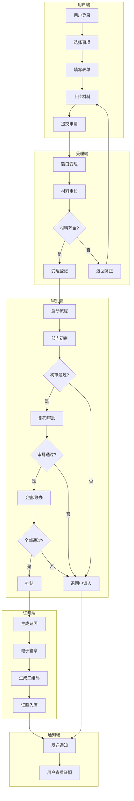
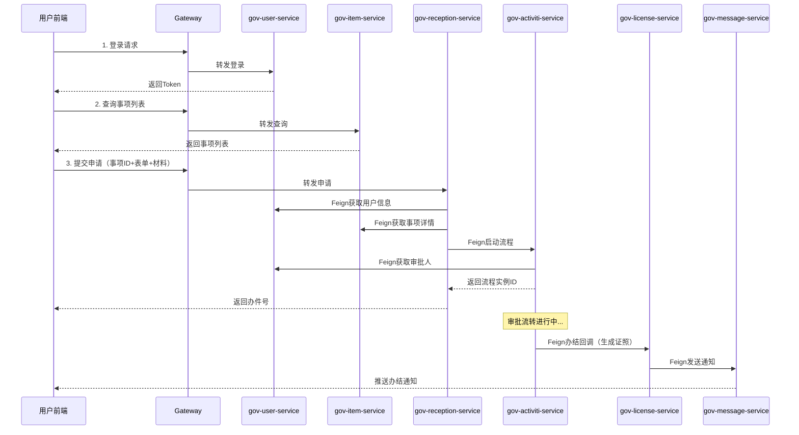
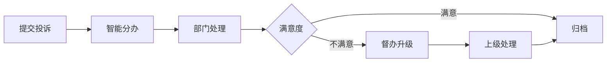
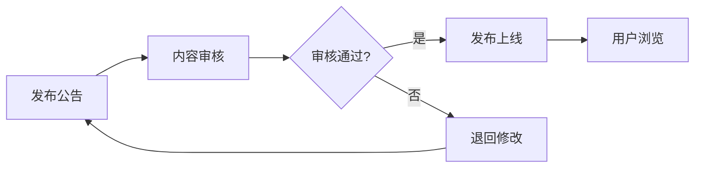
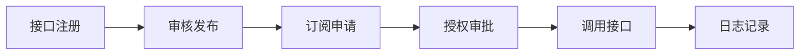

# 业务流程说明

> 本文档定义智慧政务平台的核心业务流程，供所有组员理解业务逻辑，也供 AI 生成业务代码时遵循。**所有成员使用 AI 开发业务代码必须按本文档约束生成，避免流程混乱。**

---

## 一、核心业务流程总览

智慧政务一体化便民服务平台的核心是 **"一网通办、一窗受理、协同办理"**，黄金流程如下：



---

## 二、黄金流程详解（一网通办）

### 2.1 流程阶段划分

| 阶段 | 服务 | 主要操作 | 数据流向 |
|------|------|----------|----------|
| **① 用户申请** | gov-user-service + gov-item-service | 登录、选事项、填表单、上传材料 | 用户数据 → gov_user 库 |
| **② 窗口受理** | gov-reception-service | 受理登记、材料审核、生成办件号 | 办件数据 → gov_reception 库 |
| **③ 流程启动** | gov-activiti-service | 启动 Activiti 流程、分配任务 | 流程数据 → gov_activiti 库 + ACT_* 表 |
| **④ 审批流转** | gov-activiti-service | 初审、审批、会签、转办、驳回 | 任务数据 → ACT_RU_TASK |
| **⑤ 证照生成** | gov-license-service | 生成 OFD/PDF、签章、二维码 | 证照数据 → gov_license 库 |
| **⑥ 结果通知** | gov-message-service | 短信/邮件/站内信通知 | 消息数据 → gov_message 库 |

### 2.2 服务间调用链



---

## 三、核心业务场景详解

### 3.1 用户申请场景

#### 3.1.1 用户登录

**流程步骤**：

1. 用户输入用户名/手机号 + 密码
2. gov-user-service 校验密码（BCrypt）
3. 生成 JWT Token（有效期 2 小时）
4. Token 存入 Redis（db 1），key: `user:token:{userId}`
5. 返回 Token + 用户基本信息

**AI Prompt 模板**：

```text
【模块】gov-user-service
【场景】用户登录
【技术栈】SpringBoot 2.7.18 + JWT + Redis
【输入】
- username：用户名
- password：密码（明文）
【输出】
- token：JWT Token
- userInfo：用户基本信息
【约束】
1. 密码使用 BCrypt 校验
2. Token 有效期 2 小时
3. Token 存入 Redis db 1
4. 登录成功记录 t_login_log
请给出 Controller + Service 方法代码。
```

#### 3.1.2 选择事项

**流程步骤**：

1. 用户查询事项分类树
2. 选择分类，查询事项列表
3. 点击事项，查看办事指南
4. 查看材料清单、办理流程、时限

**数据结构**：

```json
// 事项列表返回
{
  "code": 200,
  "data": {
    "records": [
      {
        "id": 10001,
        "itemCode": "ITEM001",
        "itemName": "身份证办理",
        "deptId": 20001,
        "deptName": "公安局",
        "itemType": 1,
        "timeLimit": "7个工作日",
        "status": 1
      }
    ],
    "total": 100
  }
}

// 办事指南返回
{
  "code": 200,
  "data": {
    "itemId": 10001,
    "guideContent": "办理流程说明...",
    "materials": [
      {"name": "身份证原件", "isRequired": true},
      {"name": "户口本", "isRequired": true}
    ],
    "timeLimit": "7个工作日",
    "processDesc": "窗口受理 → 审批 → 制证"
  }
}
```

#### 3.1.3 填写表单

**流程步骤**：

1. 根据事项ID获取表单配置（form_schema）
2. 前端动态渲染表单组件
3. 用户填写表单数据
4. 前端校验 + 后端校验
5. 表单数据暂存 Redis（草稿）

**表单配置 JSON 示例**：

```json
{
  "formType": "dynamic",
  "fields": [
    {"name": "realName", "label": "姓名", "type": "text", "required": true},
    {"name": "idCard", "label": "身份证号", "type": "text", "required": true, "pattern": "^[0-9X]{18}$"},
    {"name": "phone", "label": "手机号", "type": "text", "required": true},
    {"name": "address", "label": "地址", "type": "textarea", "required": false}
  ]
}
```

#### 3.1.4 上传材料

**流程步骤**：

1. 用户选择材料类型
2. 上传文件（图片/PDF）
3. 文件存储到本地/OSS
4. 返回文件 URL
5. 材料清单状态更新

**约束**：
- 单个文件最大 10MB
- 图片格式：jpg/png
- PDF 格式：pdf
- 文件命名：`{applyNo}_{materialId}_{timestamp}.{ext}`

---

### 3.2 窗口受理场景

#### 3.2.1 受理登记

**流程步骤**：

1. 窗口工作人员查看待受理列表
2. 选择办件，查看申请详情
3. 核验材料完整性
4. 受理通过：生成办件号，状态改为"受理中"
5. 受理驳回：退回申请人，注明缺失材料

**办件号生成规则**：

```java
// 办件号格式：年份 + 部门编码 + 序号
// 示例：2024SZ001001
public String generateApplyNo(Long deptId) {
    String year = DateUtil.format(new Date(), "yyyy");
    String deptCode = deptService.getDeptCode(deptId); // 2位部门编码
    String seq = redisUtil.incr("apply:seq:" + year + deptCode); // 6位序号
    return year + deptCode + String.format("%06d", seq);
}
```

**AI Prompt 模板**：

```text
【模块】gov-reception-service
【场景】窗口受理登记
【技术栈】SpringBoot 2.7.18 + MyBatis-Plus + Redis
【输入】
- applyId：申请ID
- operatorId：受理人ID
- acceptResult：受理结果（1通过 2驳回）
- rejectReason：驳回原因（如材料缺失）
【约束】
1. 受理通过生成办件号（年份+部门编码+序号）
2. 状态更新为"受理中"（status=1）
3. 记录受理日志到 t_reception_log
4. 受理驳回需注明缺失材料
请给出 Controller + Service 方法代码。
```

#### 3.2.2 材料审核

**流程步骤**：

1. 查看材料清单
2. 逐项核验材料
3. 标记材料状态（合格/不合格/缺失）
4. 全部合格 → 进入审批
5. 有不合格 → 退回补正

---

### 3.3 审批流转场景（核心）

#### 3.3.1 流程启动

**流程步骤**：

1. gov-reception-service 调用 gov-activiti-service
2. 根据事项类型选择流程模板（BPMN）
3. 设置流程变量（applyNo、userId、deptId）
4. 启动流程实例
5. 返回流程实例ID

**Feign 调用示例**：

```java
// gov-reception-service/feign/ActivitiFeignClient.java
@FeignClient(name = "gov-activiti-service")
public interface ActivitiFeignClient {
    
    @PostMapping("/api/v1/workflow/start")
    Result<String> startProcess(@RequestBody StartProcessDTO dto);
}

// StartProcessDTO
@Data
public class StartProcessDTO {
    private String processKey;     // 流程Key：apply_approval_v1
    private String applyNo;        // 办件号
    private Long userId;           // 申请人ID
    private Long deptId;           // 部门ID
    private Long itemId;           // 事项ID
}
```

#### 3.3.2 待办任务查询

**流程步骤**：

1. 用户登录，获取 userId
2. 查询 ACT_RU_TASK 表，条件：assignee = userId 或 candidateGroups 包含用户角色
3. 返回待办任务列表（任务ID、任务名称、办件号、到期时间）
4. 前端展示待办列表

**查询 SQL**：

```sql
SELECT t.ID_, t.NAME_, t.ASSIGNEE_, t.CREATE_TIME_, t.DUE_TIME_,
       v.TEXT_ as applyNo
FROM ACT_RU_TASK t
LEFT JOIN ACT_RU_VARIABLE v ON t.PROC_INST_ID_ = v.PROC_INST_ID_ AND v.NAME_ = 'applyNo'
WHERE t.ASSIGNEE_ = #{userId}
   OR EXISTS (
       SELECT 1 FROM ACT_RU_IDENTITYLINK i 
       WHERE i.TASK_ID_ = t.ID_ AND i.GROUP_ID_ IN #{userGroups}
   )
ORDER BY t.CREATE_TIME_ DESC
```

#### 3.3.3 任务审批

**流程步骤**：

1. 用户点击待办任务
2. 查看办件详情、表单数据、材料
3. 选择审批结果（通过/驳回/转办）
4. 填写审批意见
5. 提交审批
6. 流程流转到下一节点

**审批结果处理**：

| 审批结果 | 流程动作 | 说明 |
|----------|----------|------|
| 通过 | 流程流转到下一节点 | 设置 `approvalResult=1` |
| 驳回 | 流程退回申请人 | 设置 `approvalResult=2`，申请人需重新提交 |
| 转办 | 任务转给其他人 | 修改 assignee，原审批人不再可见 |
| 会签 | 多人并行审批 | 等待全部通过后才流转 |

**AI Prompt 模板**：

```text
【模块】gov-activiti-service
【场景】任务审批
【技术栈】Activiti 7.7.0 + SpringBoot 2.7.18
【输入】
- taskId：任务ID
- userId：审批人ID
- approvalResult：审批结果（1通过 2驳回 3转办）
- approvalOpinion：审批意见
- nextAssignee：转办目标人（如需转办）
【约束】
1. 先校验任务是否属于当前用户
2. 使用 taskService.complete() 完成任务
3. 设置流程变量 approvalResult、approvalOpinion
4. 审批意见保存到 t_workflow_opinion 表
5. 转办需修改任务 assignee
请给出 Controller + Service 方法代码。
```

#### 3.3.4 会签处理

**流程步骤**：

1. 流程到达会签节点
2. 多实例任务并行创建（每个部门一个任务）
3. 各部门审批人各自审批
4. 汇聚网关等待全部完成
5. 判断是否全部通过
6. 全部通过 → 流程继续
7. 有驳回 → 流程退回

**会签配置**：

```xml
<userTask id="task_countersign" name="多部门会签">
  <multiInstanceLoopCharacteristics isSequential="false">
    <loopCardinality>${deptList.size()}</loopCardinality>
    <completionCondition>${nrOfCompletedInstances == nrOfInstances}</completionCondition>
  </multiInstanceLoopCharacteristics>
</userTask>
```

---

### 3.4 证照生成场景

#### 3.4.1 证照生成流程

**流程步骤**：

1. 流程办结，触发证照生成监听器
2. 查询证照模板（t_license_catalog）
3. 填充证照数据（申请人信息、事项信息）
4. 生成 OFD/PDF 文件
5. 调用电子签章服务（模拟）
6. 生成核验二维码
7. 存储证照数据到 t_license_data
8. 更新办件状态为"办结"

**证照数据 JSON 示例**：

```json
{
  "licenseNo": "LIC20240001",
  "catalogId": 10001,
  "userId": 10001,
  "applyNo": "2024SZ001001",
  "licenseContent": {
    "holderName": "张三",
    "idCard": "320123199001011234",
    "issueDate": "2024-01-01",
    "validUntil": "2034-01-01",
    "issuer": "公安局"
  },
  "fileUrl": "/license/LIC20240001.ofd",
  "qrCode": "/qr/LIC20240001.png"
}
```

**AI Prompt 模板**：

```text
【模块】gov-license-service
【场景】证照生成
【技术栈】SpringBoot 2.7.18 + iText/PdfBox + Hutool
【输入】
- applyNo：办件号
- userId：申请人ID
- catalogId：证照目录ID
【约束】
1. 查询证照模板获取模板文件
2. 填充申请人信息到模板
3. 生成 PDF 文件（使用 iText 或 PdfBox）
4. 生成核验二维码（使用 Hutool QrCodeUtil）
5. 证照数据存入 t_license_data 表
6. 返回证照ID和文件URL
请给出 Service 方法代码。
```

#### 3.4.2 证照核验

**流程步骤**：

1. 用户扫描二维码或输入证照编号
2. gov-license-service 查询证照数据
3. 校验证照状态（有效/过期/注销）
4. 返回证照详情
5. 记录核验日志

---

### 3.5 消息通知场景

#### 3.5.1 通知类型

| 通知类型 | 触发时机 | 渠道 | 内容模板 |
|----------|----------|------|----------|
| 待办提醒 | 任务创建 | 内信 + APP推送 | "您有新的待办任务：{事项名称}" |
| 办结通知 | 流程结束 | 站内信 + 短信 | "您的申请已办结，证照编号：{licenseNo}" |
| 预警通知 | 黄牌/红牌 | 站内信 + 短信 | "任务即将超期，请尽快处理" |
| 验真通知 | 证照核验 | 站内信 | "您的证照被核验，核验人：{核验人}" |

#### 3.5.2 消息发送流程

**流程步骤**：

1. 业务服务调用 gov-message-service Feign 接口
2. 根据模板ID获取消息内容
3. 替换模板变量（${applyNo}、${itemName}）
4. 选择发送渠道（站内信/短信/邮件）
5. 发送消息（模拟：短信/邮件记录日志，站内信入库）
6. 记录发送日志

---

## 四、辅助业务场景

### 4.1 投诉建议流程



### 4.2 政务公开流程



### 4.3 数据共享流程



---

## 五、AI 生成业务代码约束清单

所有成员使用 AI 生成业务代码时，必须遵守以下约束：

### 5.1 数据约束

| 约束项 | 说明 |
|--------|------|
| 主键 | 使用雪花 ID（`IdUtil.getSnowflakeNextId()`） |
| 逻辑删除 | `deleted` 字段，`@TableLogic` |
| 时间字段 | `create_time`、`update_time` 自动填充 |
| 敏感数据 | 身份证号 SM4 加密，密码 BCrypt |
| 状态字段 | 使用枚举类，禁止硬编码数字 |

### 5.2 服务调用约束

| 约束项 | 说明 |
|--------|------|
| Feign 调用 | 使用 `@FeignClient(name = "服务名")` |
| 服务名 | 与 `spring.application.name` 一致 |
| 接口路径 | `/api/v1/{模块}/{操作}` |
| 返回值 | 统一使用 `Result<T>` |
| 异常处理 | 使用 `BusinessException` |

### 5.3 流程约束

| 约束项 | 说明 |
|--------|------|
| 流程变量 | 使用 `WorkflowConstants` 常量 |
| 流程 Key | `{业务缩写}_v{版本号}` |
| 任务监听器 | 必须配置 create/complete 监听器 |
| 审批结果 | `1`=通过, `2`=驳回, `3`=转办 |

### 5.4 接口约束

| 约束项 | 说明 |
|--------|------|
| Knife4j | Controller 必须加 `@Operation`（OpenAPI 3 注解，禁止使用 Swagger2 的 `@ApiOperation`） |
| 参数校验 | DTO 使用 `@NotBlank`、`@Pattern` |
| 分页参数 | `pageNum`、`pageSize`（默认 1、10） |
| 接口签名 | 对外接口必须验签 |

---

## 六、业务流程测试入口

- Knife4j 文档：`http://localhost:8091/doc.html`
- 用户登录：`POST /api/v1/user/login`
- 事项查询：`GET /api/v1/item/list`
- 提交申请：`POST /api/v1/reception/apply`
- 待办查询：`GET /api/v1/workflow/todo/{userId}`
- 任务审批：`POST /api/v1/workflow/approve`
- 证照查询：`GET /api/v1/license/{licenseNo}`