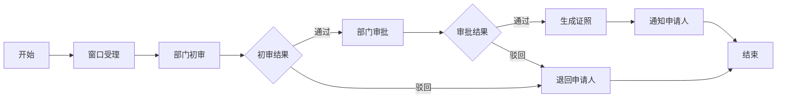
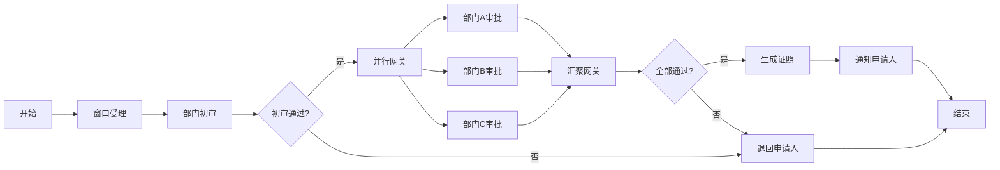
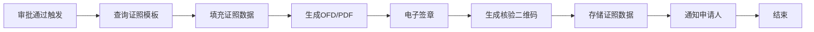
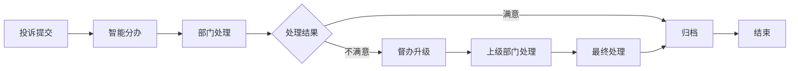

# 工作流设计文档

> 本文档定义 Activiti 7.1.0.M6 工作流引擎的使用规范、流程设计模板、节点命名约定，供组员B开发审批流转服务参考，也供 AI 生成 BPMN 和流程代码时遵循。**所有成员使用 AI 开发工作流相关代码必须按本文档约束生成。**

---

## 一、Activiti 全局配置规范

### 1.1 流程引擎配置

```yaml
# application-dev.yml
activiti:
  database-schema-update: true        # 自动创建/更新 ACT_* 表
  history-level: full                 # 记录全部历史（实例、任务、变量、详情）
  async-executor-activate: true       # 异步执行器开启
  job-executor-activate: true         # 定时任务执行器开启
```

### 1.2 BPMN 文件存放位置

```text
gov-activiti-service/
└── src/main/resources/
    └── processes/                    ← BPMN 文件统一存放目录
        ├── single_dept_approval.bpmn     ← 单部门审批流程
        ├── multi_dept_countersign.bpmn   ← 多部门会签流程
        ├── license_issue.bpmn            ← 证照发放流程
        └── complaint_handle.bpmn         ← 投诉处理流程
```

### 1.3 流程 Key 命名规范

| 规则 | 说明 | 示例 |
|------|------|------|
| 格式 | `{业务缩写}_v{版本号}` | `apply_approval_v1` |
| 业务缩写 | 小写字母，不超过10字符 | `apply`、`license`、`complaint` |
| 版本号 | 从 v1 开始，大版本递增 | `v1`、`v2`、`v3` |
| 禁止 | 禁止使用中文、特殊字符 | ❌ `审批流程_v1` |

---

## 二、流程节点设计规范

### 2.1 节点类型与命名

| 节点类型 | BPMN 元素 | 命名规范 | 说明 |
|----------|-----------|----------|------|
| 开始节点 | `startEvent` | `start_{业务}` | 流程起点，必须存在 |
| 结束节点 | `endEvent` | `end_{业务}` | 流程终点，必须存在 |
| 用户任务 | `userTask` | `task_{动作}_{角色}` | 需人工审批的任务 |
| 服务任务 | `serviceTask` | `service_{动作}` | 自动执行的服务调用 |
| 网关（排他） | `exclusiveGateway` | `gateway_{条件}` | 条件分支 |
| 网关（并行） | `parallelGateway` | `gateway_parallel_{场景}` | 并行执行（会签） |

### 2.2 任务节点命名示例

| 任务名称 | BPMN id | assignee/candidateGroups | 说明 |
|----------|---------|---------------------------|------|
| 部门初审 | `task_review_dept` | `candidateGroups: dept_staff` | 部门工作人员初审 |
| 部门审批 | `task_approve_dept` | `candidateGroups: dept_leader` | 部门领导审批 |
| 联合审批 | `task_countersign_multi` | `candidateGroups: multi_dept` | 多部门会签 |
| 证照生成 | `service_generate_license` | — | 自动调用证照服务 |
| 结果通知 | `service_notify_user` | — | 自动发送通知 |

### 2.3 流程变量命名规范

| 变量名 | 类型 | 说明 | 示例 |
|--------|------|------|------|
| `applyNo` | String | 办件号 | `2024SZ001001` |
| `userId` | Long | 申请人ID | `10001` |
| `deptId` | Long | 部门ID | `20001` |
| `itemId` | Long | 事项ID | `30001` |
| `approvalResult` | Integer | 审批结果 | `1`=通过, `2`=驳回 |
| `approvalOpinion` | String | 审批意见 | `材料齐全，同意办理` |
| `nextAssignee` | String | 下一审批人 | `user:10002` |

> **禁止硬编码字符串**：所有流程变量必须在 `gov-common` 的 `WorkflowConstants` 类中定义常量。

```java
// gov-common/constant/WorkflowConstants.java
public class WorkflowConstants {
    public static final String VAR_APPLY_NO = "applyNo";
    public static final String VAR_USER_ID = "userId";
    public static final String VAR_DEPT_ID = "deptId";
    public static final String VAR_APPROVAL_RESULT = "approvalResult";
    public static final String VAR_APPROVAL_OPINION = "approvalOpinion";
}
```

---

## 三、核心流程设计模板

### 3.1 单部门审批流程（single_dept_approval.bpmn）

**适用场景**：简单事项，单个部门审批即可办结。



**BPMN 结构说明**：

| 节点 | id | 类型 | assignee/candidateGroups | 说明 |
|------|-----|------|---------------------------|------|
| 开始 | `start_apply` | startEvent | — | 流程启动 |
| 窗口受理 | `task_accept_window` | userTask | `candidateGroups: window_staff` | 窗口工作人员受理 |
| 部门初审 | `task_review_dept` | userTask | `candidateGroups: dept_staff` | 部门工作人员初审 |
| 部门审批 | `task_approve_dept` | userTask | `candidateGroups: dept_leader` | 部门领导审批 |
| 生成证照 | `service_generate_license` | serviceTask | — | 调用证照服务生成 |
| 通知申请人 | `service_notify_user` | serviceTask | — | 调用消息服务通知 |
| 结束 | `end_apply` | endEvent | — | 流程结束 |

**排他网关条件表达式**：

```xml
<!-- 初审结果判断 -->
<exclusiveGateway id="gateway_review_result" />
<sequenceFlow sourceRef="gateway_review_result" targetRef="task_approve_dept">
  <conditionExpression>${approvalResult == 1}</conditionExpression>
</sequenceFlow>
<sequenceFlow sourceRef="gateway_review_result" targetRef="task_return_user">
  <conditionExpression>${approvalResult == 2}</conditionExpression>
</sequenceFlow>
```

---

### 3.2 多部门会签流程（multi_dept_countersign.bpmn）

**适用场景**：复杂事项，需要多个部门联合审批。



**会签配置**：

```xml
<!-- 多实例任务配置 -->
<userTask id="task_countersign_multi" name="多部门会签">
  <multiInstanceLoopCharacteristics isSequential="false">
    <loopCardinality>${deptList.size()}</loopCardinality>
    <completionCondition>${nrOfCompletedInstances == nrOfInstances && allApproved}</completionCondition>
  </multiInstanceLoopCharacteristics>
  <assignee>${deptLeader}</assignee>
</userTask>
```

**会签规则**：
- `isSequential="false"`：并行执行，各部门同时审批
- `completionCondition`：全部通过才算会签完成
- `loopCardinality`：参与会签的部门数量

---

### 3.3 证照发放流程（license_issue.bpmn）

**适用场景**：审批通过后自动生成电子证照。



**服务任务配置**：

```xml
<serviceTask id="service_generate_license" name="生成证照"
             activiti:class="com.gov.activiti.listener.LicenseGenerateListener" />
<serviceTask id="service_sign_license" name="电子签章"
             activiti:class="com.gov.activiti.listener.LicenseSignListener" />
<serviceTask id="service_notify_user" name="通知申请人"
             activiti:class="com.gov.activiti.listener.MessageNotifyListener" />
```

---

### 3.4 投诉处理流程（complaint_handle.bpmn）

**适用场景**：投诉建议的督办处理。



---

## 四、Activiti 监听器规范

### 4.1 监听器类型

| 类型 | 触发时机 | 用途 |
|------|----------|------|
| `ExecutionListener` | 流程实例开始/结束 | 日志埋点、数据初始化 |
| `TaskListener` | 任务创建/完成/分配 | 自动催办、状态同步 |
| `EventListener` | 全局事件 | 异常处理、审计日志 |

### 4.2 监听器代码模板

```java
// gov-activiti-service/listener/TaskCreateListener.java
@Component
public class TaskCreateListener implements TaskListener {
    
    @Override
    public void notify(DelegateTask task) {
        // 任务创建时自动设置到期时间（黄牌预警）
        LocalDateTime dueDate = LocalDateTime.now().plusHours(24); // 24小时
        task.setDueDate(dueDate);
        
        // 记录任务创建日志
        log.info("任务创建：taskId={}, name={}, assignee={}", 
                 task.getId(), task.getName(), task.getAssignee());
        
        // 发送待办通知
        messageService.sendTodoNotice(task.getAssignee(), task.getName());
    }
}
```

```java
// gov-activiti-service/listener/TaskCompleteListener.java
@Component
public class TaskCompleteListener implements TaskListener {
    
    @Override
    public void notify(DelegateTask task) {
        // 任务完成时检查是否超时（红牌预警）
        if (task.getDueDate() != null && LocalDateTime.now().isAfter(task.getDueDate().toInstant().atZone(ZoneId.systemDefault()).toLocalDateTime())) {
            monitorService.recordWarning(task.getId(), "RED_CARD");
        }
        
        // 记录审批意见
        String opinion = (String) task.getVariable(WorkflowConstants.VAR_APPROVAL_OPINION);
        workflowService.saveOpinion(task.getId(), opinion);
    }
}
```

### 4.3 BPMN 中配置监听器

```xml
<userTask id="task_review_dept" name="部门初审">
  <extensionElements>
    <activiti:taskListener event="create" class="com.gov.activiti.listener.TaskCreateListener" />
    <activiti:taskListener event="complete" class="com.gov.activiti.listener.TaskCompleteListener" />
  </extensionElements>
</userTask>
```

---

## 五、红黄牌预警机制

### 5.1 预警规则

| 预警类型 | 触发条件 | 处理方式 |
|----------|----------|----------|
| 黄牌 | 任务距离到期时间 ≤ 4小时 | 自动催办通知 |
| 红牌 | 任务已超期 | 上报监察审计服务，督办升级 |

### 5.2 定时任务实现

```java
// gov-activiti-service/task/WarningTask.java
@Scheduled(cron = "0 0 */1 * * ?")  // 每小时执行
public void checkWarning() {
    // 查询即将超期的任务（黄牌）
    List<Task> yellowTasks = taskService.createTaskQuery()
        .dueBefore(LocalDateTime.now().plusHours(4))
        .list();
    yellowTasks.forEach(task -> {
        messageService.sendWarningNotice(task.getAssignee(), "YELLOW");
        monitorService.recordWarning(task.getId(), "YELLOW_CARD");
    });
    
    // 查询已超期的任务（红牌）
    List<Task> redTasks = taskService.createTaskQuery()
        .dueBefore(LocalDateTime.now())
        .list();
    redTasks.forEach(task -> {
        monitorService.recordWarning(task.getId(), "RED_CARD");
        // 督办升级
        complaintService.upgradeSupervise(task.getId());
    });
}
```

---

## 六、AI 生成工作流代码 Prompt 模板

### 6.1 BPMN 生成 Prompt

```text
【模块】gov-activiti-service
【技术栈】Activiti 7.1.0.M6
【流程名称】单部门审批流程
【流程Key】apply_approval_v1
【节点】
1. start_apply：开始节点
2. task_accept_window：窗口受理，candidateGroups=window_staff
3. task_review_dept：部门初审，candidateGroups=dept_staff
4. gateway_review_result：排他网关，判断初审结果
5. task_approve_dept：部门审批，candidateGroups=dept_leader
6. gateway_approve_result：排他网关，判断审批结果
7. service_generate_license：服务任务，调用证照服务
8. service_notify_user：服务任务，调用消息服务
9. task_return_user：退回申请人
10. end_apply：结束节点
【流程变量】
- applyNo：办件号
- userId：申请人ID
- deptId：部门ID
- approvalResult：审批结果（1通过 2驳回）
- approvalOpinion：审批意见
【约束】
1. 流程Key命名：apply_approval_v1
2. 任务节点必须配置 TaskListener（create/complete）
3. 网关条件使用 ${approvalResult == 1} 格式
4. 服务任务使用 activiti:class 指定监听器类
请生成完整的 BPMN XML 文件。
```

### 6.2 流程启动 Prompt

```text
【模块】gov-activiti-service
【技术栈】Activiti 7.1.0.M6 + SpringBoot 2.7.18
【需求】启动审批流程
【输入】
- applyNo：办件号
- itemId：事项ID
- userId：申请人ID
- deptId：受理部门ID
【约束】
1. 使用 runtimeService.startProcessInstanceByKey()
2. 流程变量使用 WorkflowConstants 常量
3. 启动后记录流程实例ID到 gov_reception_record 表
4. 返回流程实例ID
请给出 Service 方法代码。
```

### 6.3 任务审批 Prompt

```text
【模块】gov-activiti-service
【技术栈】Activiti 7.1.0.M6
【需求】审批任务
【输入】
- taskId：任务ID
- userId：审批人ID
- approvalResult：审批结果（1通过 2驳回）
- approvalOpinion：审批意见
【约束】
1. 先校验任务是否属于当前用户
2. 使用 taskService.complete() 完成任务
3. 设置流程变量 approvalResult、approvalOpinion
4. 审批意见保存到 t_workflow_opinion 表
请给出 Controller + Service 方法代码。
```

---

## 七、流程变更流程

1. **新增流程**：先设计 BPMN，再编写监听器，最后测试流程图。
2. **修改流程**：新版本 BPMN 使用新流程 Key（`v2`），旧版本流程继续运行。
3. **删除流程**：不物理删除，标记为 `status=0`（禁用）。
4. **流程测试**：每个流程必须在 Knife4j 中完整跑通一遍（启动→审批→结束）。

---

## 八、流程调试入口

- Knife4j 接口文档：`http://localhost:8084/doc.html`
- 流程图查看：`http://localhost:8084/api/v1/workflow/diagram/{instanceId}`
- 待办任务查询：`http://localhost:8084/api/v1/workflow/todo/{userId}`