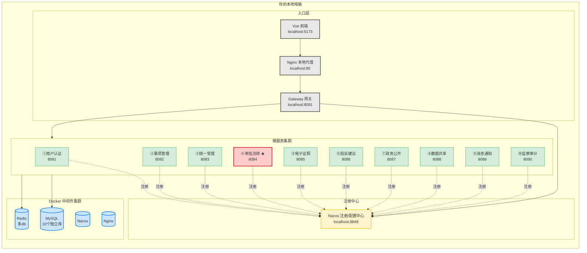
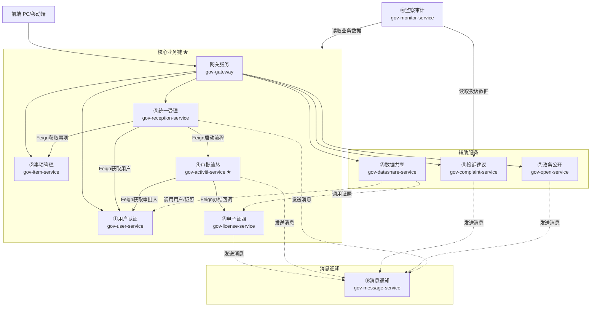

# 智慧政务一体化便民服务平台 — 项目介绍

> 本文档是项目总览，所有成员入门必读。包含项目背景、技术栈、本地架构、目录结构、成员分工、协作节奏与质量门禁。

***

## 一、项目背景

**项目名称**：智慧政务一体化便民服务平台

**核心目标**：

- 整合政务服务事项、在线办理、审批流转、数据共享、电子证照、投诉建议、政务公开。
- 实现"一网通办、一窗受理、协同办理"。

**技术栈**：

| 分类        | 技术 / 框架                   | 版本号             | 用途说明                       |
| --------- | ------------------------- | --------------- | -------------------------- |
| 基础运行      | JDK                       | 17              | LTS 版本，SpringBoot 2.7 完美支持 |
| <br />    | Maven                     | 3.8.x / 3.9.x   | 项目构建工具                     |
| 核心框架      | Spring Boot               | 2.7.18          | 2.x 最终稳定版                  |
| <br />    | Spring Cloud              | 2021.0.8        | 对应 SpringBoot 2.7 的微服务全家桶  |
| <br />    | Spring Cloud Alibaba      | 2021.0.5.0      | Nacos、Sentinel 等阿里组件       |
| 注册 & 配置中心 | Nacos                     | 2.2.3           | 服务注册发现 + 配置中心              |
| 网关        | Spring Cloud Gateway      | 3.1.x           | 微服务网关                      |
| 持久层       | MyBatis-Plus              | 3.5.5           | ORM 框架，增强 CRUD             |
| <br />    | MySQL                     | 8.0.33          | 主业务数据库                     |
| <br />    | Druid                     | 1.2.20          | 数据库连接池                     |
| 缓存        | Redis                     | 7.x             | 缓存、会话、分布式锁                 |
| 工作流       | Activiti                  | 7.1.0.M6        | 审批流转引擎                     |
| 接口文档      | Knife4j                   | 4.4.0           | Swagger 增强，前后端联调           |
| 工具类       | Hutool                    | 5.8.25          | 国产工具类库                     |
| <br />    | Lombok                    | 随 SpringBoot    | 简化实体类代码                    |
| JSON      | Fastjson2                 | 2.0.43          | JSON 序列化（注意安全配置）           |
| 安全加密      | BouncyCastle              | 1.77            | CA 签名、国密算法支持               |
| 日志        | Logback                   | 随 SpringBoot    | 默认日志框架                     |
| 文件处理      | Apache POI                | 5.2.5           | Excel 导入导出                 |
| <br />    | iText / PdfBox            | 2.x / 3.x       | PDF 生成（电子证照用）              |
| 前端        | Vue                       | 2.7 或 3.x       | 前端框架                       |
| <br />    | Element UI / Element Plus | 2.15.x / 2.7.x  | UI 组件库                     |
| <br />    | Axios                     | 1.x             | HTTP 请求                    |
| <br />    | Mock.js                   | 1.x             | 前端 Mock 数据                 |
| 部署        | Docker                    | 24.x / 25.x     | 容器化                        |
| <br />    | Nginx                     | 1.25.x          | 反向代理                       |
| 开发工具      | IDEA                      | 2023.x / 2024.x | 开发 IDE                     |
| <br />    | Git                       | 最新版             | 版本控制                       |

> 注：项目暂不使用 Oracle，先用 MySQL 代替；后续若需 Oracle 兼容，再统一增加 `ojdbc8` 驱动与配置。

***

## 二、本地完整微服务架构（每人一套）



### 核心原则

1. **每人本地一套完整闭环环境**：Nacos、MySQL、Redis、Nginx 全部跑在自己电脑上。
2. **服务间本地直连**：Feign 调用走本地 Nacos 注册发现，不跨机器。
3. **数据库完全隔离**：每人自己的 Docker MySQL，改库表、删库不影响别人。
4. **按需启动**：开发哪个服务就启动哪个，内存不够时不启动无关服务。
5. **跨平台一致**：Mac 与 Windows 使用同一套 Docker Compose 和 IDEA 配置。

***

## 三、项目目录结构

```
gov-platform/                    ← 项目根目录（Git仓库）
│
├── 00-项目文档/                  ← 项目说明文档（组长）
│   ├── 项目介绍.md               ← 本文档（项目总览，入门必读）
│   ├── 开发规范.md               ← 工程结构、命名、数据库、Git 等规范
│   ├── 接口规范.md               ← RESTful 接口协议、统一响应体、Knife4j 注解
│   ├── 数据库设计文档.md          ← 各服务数据库表结构设计
│   ├── 业务流程说明.md            ← 核心业务流程（申请→受理→审批→证照→通知）
│   ├── 工作流设计文档.md          ← Activiti 工作流引擎规范与模板
│   ├── 环境搭建指南.md            ← Docker 本地环境搭建与调试
│   └── AI编码Prompt模板.md       ← AI 辅助开发规范与 Prompt 模板
│
├── docker/                      ← Docker本地环境（统一配置）
│   ├── docker-compose.yml       ← 一键启动所有中间件（MySQL+Redis+Nacos+Nginx）
│   ├── mysql/
│   │   └── init/                ← MySQL初始化SQL（建库、建表）
│   │       ├── 01-init-db.sql   ← 创建所有微服务数据库（共10个库）
│   │       └── 02-init-data.sql ← 插入系统字典、默认配置等基础数据
│   ├── redis/
│   ├── nacos/
│   │   └── nacos_config_export.zip  ← Nacos配置导出（含各服务dev配置）
│   └── nginx/
│       └── nginx.conf           ← 网关反向代理、静态资源映射
│
├── sql/                         ← MySQL数据库脚本
│   ├── schema/                  ← 建表脚本（各微服务独立库）
│   │   ├── gov_user.sql         ← 用户认证库
│   │   ├── gov_item.sql         ← 事项管理库
│   │   ├── gov_reception.sql    ← 统一受理库
│   │   ├── gov_activiti.sql     ← 审批流转库
│   │   ├── gov_license.sql      ← 电子证照库
│   │   ├── gov_complaint.sql    ← 投诉建议库
│   │   ├── gov_open.sql         ← 政务公开库
│   │   ├── gov_datashare.sql    ← 数据共享库
│   │   ├── gov_message.sql      ← 消息通知库
│   │   └── gov_monitor.sql      ← 监察审计库
│   └── data/                    ← 初始化数据
│       └── dict_data.sql
│
├── gov-platform-parent/         ← 父工程（组长维护）
│   └── pom.xml                  ← 锁定SpringBoot、Cloud、MyBatis-Plus、Activiti版本
│
├── gov-common/                  ← 公共模块（组长维护）
│   ├── pom.xml
│   └── src/main/java/com/gov/common
│       ├── result/              ← 统一返回体 Result<T>
│       ├── exception/           ← 全局异常处理
│       ├── utils/               ← 工具类（RedisUtil、SM2/SM4国密加密、JWT）
│       ├── entity/              ← 基类 BaseEntity
│       ├── enums/               ← 公共枚举
│       ├── annotation/          ← 公共注解
│       ├── config/              ← 公共配置（MyBatis-Plus、Knife4j、Redis）
│       └── constant/            ← 常量定义
│
├── gov-gateway/                 ← 网关服务（组长维护，端口：8091）
│
├── gov-user-service/            ← ① 用户认证服务（组员A/组长，端口：8081）
├── gov-item-service/            ← ② 事项管理服务（组员A/组长，端口：8092）
├── gov-reception-service/       ← ③ 统一受理服务（组员B，端口：8083）
├── gov-activiti-service/        ← ④ 审批流转服务（组员C，端口：8084）【核心】
├── gov-license-service/         ← ⑤ 电子证照服务（组员C，端口：8085）
├── gov-complaint-service/       ← ⑥ 投诉建议服务（组员D，端口：8086）
├── gov-open-service/            ← ⑦ 政务公开服务（组员B，端口：8087）
├── gov-datashare-service/       ← ⑧ 数据共享服务（组员D，端口：8088）
├── gov-message-service/         ← ⑨ 消息通知服务（组员D，端口：8089）
├── gov-monitor-service/         ← ⑩ 监察审计服务（组长维护，端口：8090）
│
└── gov-web/                     ← Vue 前端（暂不开发）
```

## 详细版

```text
gov-platform/                    ← 项目根目录（Git仓库）
│
├── 00-项目文档/                  ← 项目说明文档（组长）
│   ├── 项目介绍.md               ← 本文档（项目总览，入门必读）
│   ├── 开发规范.md               ← 工程结构、命名、数据库、Git 等规范
│   ├── 接口规范.md               ← RESTful 接口协议、统一响应体、Knife4j 注解
│   ├── 数据库设计文档.md          ← 各服务数据库表结构设计
│   ├── 业务流程说明.md            ← 核心业务流程（申请→受理→审批→证照→通知）
│   ├── 工作流设计文档.md          ← Activiti 工作流引擎规范与模板
│   ├── 环境搭建指南.md            ← Docker 本地环境搭建与调试
│   └── AI编码Prompt模板.md       ← AI 辅助开发规范与 Prompt 模板
│
├── docker/                      ← Docker本地环境（统一配置）
│   ├── docker-compose.yml       ← 一键启动所有中间件（MySQL+Redis+Nacos+Nginx）
│   ├── mysql/
│   │   └── init/                ← MySQL初始化SQL（建库、建表）
│   │       ├── 01-init-db.sql   ← 创建所有微服务数据库（共10个库）
│   │       └── 02-init-data.sql ← 插入系统字典、默认配置等基础数据
│   ├── redis/
│   ├── nacos/
│   │   └── nacos_config_export.zip  ← Nacos配置导出（含各服务dev配置）
│   └── nginx/
│       └── nginx.conf           ← 网关反向代理、静态资源映射
│
├── sql/                         ← MySQL数据库脚本
│   ├── schema/                  ← 建表脚本（各微服务独立库）
│   │   ├── gov_user.sql         ← 用户认证库（用户、角色、权限、CA证书）
│   │   ├── gov_item.sql         ← 事项管理库（事项目录、办事指南、表单配置）
│   │   ├── gov_reception.sql    ← 统一受理库（窗口登记、办件跟踪、出件记录）
│   │   ├── gov_activiti.sql     ← 审批流转库（流程实例、任务、审批意见、会签）
│   │   ├── gov_license.sql      ← 电子证照库（证照目录、证照数据、核验记录）
│   │   ├── gov_complaint.sql    ← 投诉建议库（投诉工单、建议征集、督办反馈）
│   │   ├── gov_open.sql         ← 政务公开库（信息公开目录、通知公告、政策法规）
│   │   ├── gov_datashare.sql    ← 数据共享库（接口注册、数据交换日志、共享目录）
│   │   ├── gov_message.sql      ← 消息通知库（消息模板、发送记录、推送队列）
│   │   └── gov_monitor.sql      ← 监察审计库（操作日志、登录日志、效能统计）
│   └── data/                    ← 初始化数据（如标准行政区划、事项分类字典）
│       └── dict_data.sql
│
├── gov-platform-parent/         ← 父工程（组长维护）
│   └── pom.xml                  ← 锁定SpringBoot、Cloud、MyBatis-Plus、Activiti版本
│
├── gov-common/                  ← 公共模块（组长维护）
│   ├── pom.xml
│   └── src/main/java/com/gov/common
│       ├── result/              ← 统一返回体 Result<T>（含分页封装）
│       ├── exception/           ← 全局异常处理（业务异常、参数校验异常）
│       ├── utils/               ← 工具类（RedisUtil、SM2/SM4国密加密、身份证脱敏、JWT）
│       ├── entity/              ← 基类 BaseEntity（id、createTime、updateTime）
│       ├── enums/               ← 公共枚举（状态码、性别、事项层级、审批状态）
│       ├── annotation/          ← 公共注解（@RequirePermission、@Log、@RateLimiter）
│       ├── config/              ← 公共配置（MyBatis-Plus分页、Knife4j接口文档、Redis配置）
│       └── constant/            ← 常量定义（RedisKey、MQ队列名、业务常量）
│
├── gov-gateway/                 ← 网关服务（组长维护，端口8091）
│   ├── pom.xml
│   └── src/main/java/com/gov/gateway
│       ├── GatewayApplication.java
│       ├── config/              ← 路由配置、跨域配置、限流配置（Sentinel）
│       └── filter/              ← 全局过滤器（接口签名验签、JWT鉴权、IP黑白名单、请求日志）
│
├── gov-user-service/            ← ① 用户认证服务（组员A/组长，端口：8081）
│   ├── pom.xml
│   └── src/main/java/com/gov/user
│       ├── UserApplication.java
│       ├── controller/          ← 登录、注册、实名认证、SSO、权限校验接口
│       ├── service/             ← 用户管理、CA证书绑定、角色权限服务
│       ├── mapper/              ← 操作 gov_user 库
│       ├── entity/              ← 用户表、角色表、权限表、CA证书表、登录日志表
│       ├── dto/                 ← 登录DTO、注册DTO、用户信息DTO
│       ├── vo/                  ← 用户信息VO、菜单树VO、权限VO
│       ├── config/              ← Security配置、OAuth2资源服务器配置
│       └── security/            ← JWT工具类、自定义UserDetailsService
│
├── gov-item-service/            ← ② 事项管理服务（组员A/组长，端口：8092）
│   ├── pom.xml
│   └── src/main/java/com/gov/item
│       ├── ItemApplication.java
│       ├── controller/          ← 事项录入、发布、变更、下架、分类查询接口
│       ├── service/             ← 事项梳理、版本管理、事项与流程关联
│       ├── mapper/              ← 操作 gov_item 库
│       ├── entity/              ← 事项表、事项版本表、办事指南表、材料清单表、事项分类表
│       ├── dto/                 ← 事项DTO、指南DTO、事项查询DTO
│       └── vo/                  ← 事项树VO、事项详情VO、事项发布VO
│
├── gov-reception-service/       ← ③ 统一受理&在线办理服务（组员B，端口：8083）
│   ├── pom.xml
│   └── src/main/java/com/gov/reception
│       ├── ReceptionApplication.java
│       ├── controller/          ← 一窗登记、材料接收、业务分发、统一出件、进度查询
│       ├── service/             ← 办件号生成（规则：年份+部门编码+序号）、智能填表回填
│       ├── mapper/              ← 操作 gov_reception 库
│       ├── entity/              ← 办件主表、申报材料表、出件记录表、回执表、办件日志表
│       ├── dto/                 ← 办件提交DTO、受理登记DTO、进度查询DTO
│       ├── vo/                  ← 办件详情VO、进度时间轴VO
│       └── feign/               ← Feign客户端（调用Activiti启动流程、调用User获取信息）
│
├── gov-activiti-service/        ← ④ 审批流转服务（组员C，端口：8084）【核心】
│   ├── pom.xml
│   └── src/main/java/com/gov/activiti
│       ├── ActivitiApplication.java
│       ├── controller/          ← 待办任务、已办任务、审批通过/退回/转办/会签/委托接口
│       ├── service/             ← 流程驱动（启动/提交/驳回/跳转）、时限管控（黄牌/红牌）
│       ├── mapper/              ← 操作 gov_activiti 库（含Activiti原生ACT_*表）
│       ├── entity/              ← 业务扩展表（审批意见表、会签记录表、催办记录表）
│       ├── dto/                 ← 审批提交DTO、任务查询DTO、会签DTO
│       ├── vo/                  ← 任务详情VO、审批流程图VO
│       ├── listener/            ← Activiti监听器（任务创建/完成监听，自动催办、日志埋点）
│       ├── config/              ← Activiti配置（流程引擎、表单引擎、历史级别）
│       └── deploy/              ← 流程定义BPMN文件（如：单部门审批.bpmn、多部门会签.bpmn）
│
├── gov-license-service/         ← ⑤ 电子证照服务（组员C，端口：8085）
│   ├── pom.xml
│   └── src/main/java/com/gov/license
│       ├── LicenseApplication.java
│       ├── controller/          ← 证照生成、电子签章、二维码核验、下载、授权接口
│       ├── service/             ← 证照目录管理、OFD/PDF生成（iText/Hutool）、二维码验真
│       ├── mapper/              ← 操作 gov_license 库
│       ├── entity/              ← 证照目录表、证照数据表、证照授权记录表、核验日志表
│       ├── dto/                 ← 证照生成DTO、证照查询DTO、授权DTO
│       ├── vo/                  ← 证照详情VO、证照列表VO
│       └── client/              ← 调用电子签章中台（模拟）、CA认证中心（模拟）
│
├── gov-complaint-service/       ← ⑥ 投诉建议服务（组员D，端口：8086）
│   ├── pom.xml
│   └── src/main/java/com/gov/complaint
│       ├── ComplaintApplication.java
│       ├── controller/          ← 投诉提交、建议征集、分办处理、满意度评价、查询接口
│       ├── service/             ← 智能分办规则（关键词匹配）、督办催办、热点分析
│       ├── mapper/              ← 操作 gov_complaint 库
│       ├── entity/              ← 投诉工单表、建议表、督办记录表、处理反馈表
│       ├── dto/                 ← 投诉提交DTO、分办DTO、处理反馈DTO、统计DTO
│       ├── vo/                  ← 投诉详情VO、热点分析VO
│       └── task/                ← 定时任务（超时工单自动督办）
│
├── gov-open-service/            ← ⑦ 政务公开服务（组员A/组长，端口：8087）
│   ├── pom.xml
│   └── src/main/java/com/gov/open
│       ├── OpenApplication.java
│       ├── controller/          ← 信息公开目录、通知公告发布、依申请公开受理、政策法规查询
│       ├── service/             ← 全文检索（ES或MySQL LIKE）、公开数据统计、内容审核
│       ├── mapper/              ← 操作 gov_open 库
│       ├── entity/              ← 公开目录表、公告表、政策法规表、依申请公开表
│       ├── dto/                 ← 公告发布DTO、申请公开DTO
│       └── vo/                  ← 首页公开数据VO、公开目录树VO
│
├── gov-datashare-service/       ← ⑧ 数据共享交换服务（组员D，端口：8088）
│   ├── pom.xml
│   └── src/main/java/com/gov/datashare
│       ├── DatashareApplication.java
│       ├── controller/          ← 数据源注册、接口发布订阅、共享目录检索、调用统计
│       ├── service/             ← 数据清洗比对、跨部门推送拉取、血缘追踪
│       ├── mapper/              ← 操作 gov_datashare 库
│       ├── entity/              ← 数据源表、接口配置表、交换日志表、订阅记录表
│       ├── dto/                 ← 接口注册DTO、订阅DTO
│       ├── vo/                  ← 接口详情VO、调用统计VO
│       ├── feign/               ← 调用User获取人员信息、调用License获取证照数据
│       └── task/                ← 定时数据同步任务（XXL-JOB或@Scheduled）
│
├── gov-message-service/         ← ⑨ 消息通知服务（组员D，端口：8089）
│   ├── pom.xml
│   └── src/main/java/com/gov/message
│       ├── MessageApplication.java
│       ├── controller/          ← 消息模板管理、消息发送（批量/定时）、消息查询
│       ├── service/             ← 多渠道推送（短信模拟、邮件模拟、站内信、APP推送模拟）
│       ├── mapper/              ← 操作 gov_message 库
│       ├── entity/              ← 消息模板表、消息发送记录表、站内信表
│       ├── dto/                 ← 消息发送DTO、模板配置DTO
│       ├── vo/                  ← 消息列表VO、未读数量VO
│       └── consumer/            ← MQ消费者（RabbitMQ/Kafka，接收各服务消息请求）
│
└── gov-monitor-service/         ← ⑩ 监察审计服务（组长维护，端口：8090）
    ├── pom.xml
    └── src/main/java/com/gov/monitor
        ├── MonitorApplication.java
        ├── controller/          ← 办件统计、效能分析、数据大屏接口、审计日志查询、报表导出
        ├── service/             ← 超时预警计算（红黄牌）、满意度趋势分析、自定义报表生成
        ├── mapper/              ← 操作 gov_monitor 库（直连各业务库或通过Feign汇总）
        ├── entity/              ← 操作日志表、登录日志表、审计报告表、效能统计表
        ├── dto/                 ← 统计查询DTO、报表DTO
        ├── vo/                  ← 大屏数据VO、效能排名VO、趋势图VO
        ├── feign/               ← Feign调用各业务服务获取统计数据
        └── schedule/            ← 定时生成报表、清理过期日志、计算效能指标
```

***

## 四、本地服务端口

## 规划（强制统一）

| 服务                    | 端口          | 数据库 / Redis db         |
| --------------------- | ----------- | ---------------------- |
| Nginx                 | 80          | —                      |
| Gateway               | 8091        | —                      |
| Nacos                 | 8848 / 9848 | `nacos`                |
| gov-user-service      | 8081        | `gov_user` / db 1      |
| gov-item-service      | 8092        | `gov_item` / db 2      |
| gov-reception-service | 8083        | `gov_reception` / db 3 |
| gov-activiti-service  | 8084        | `gov_activiti` / db 4  |
| gov-license-service   | 8085        | `gov_license` / db 5   |
| gov-complaint-service | 8086        | `gov_complaint` / db 6 |
| gov-open-service      | 8087        | `gov_open` / db 7      |
| gov-datashare-service | 8088        | `gov_datashare` / db 8 |
| gov-message-service   | 8089        | `gov_message` / db 9   |
| gov-monitor-service   | 8090        | `gov_monitor` / db 10  |
| MySQL                 | 3307        | 多库（10个业务库 + nacos）     |
| Redis                 | 6379        | 多 db                   |

> 所有成员本地必须使用上表端口，避免联调混乱。

***

## 五、成员 ABCD 分工

> 组长（兼组员A）负责 `gov-platform-parent`、`gov-common`、`gov-gateway` (8091)、`gov-monitor-service` (8090)、Docker 环境、文档规范；并统筹代码 Review。

| 成员   | 负责模块                                                             | 主要职责                                     |
| ---- | ---------------------------------------------------------------- | ---------------------------------------- |
| 组员 A | `gov-user-service` (8081)`gov-item-service` (8092)`gov-open-service` (8087) | 用户认证、登录注册、CA证书绑定、事项管理、办事指南、政务公开 |
| 组员 B | `gov-reception-service` (8083)                                  | 统一受理、一窗登记、办件跟踪 |
| 组员 C | `gov-activiti-service` (8084)【核心】`gov-license-service` (8085)  | Activiti 审批流转、待办/已办、会签/转办、电子证照生成/验真、OFD/PDF生成 |
| 组员D | `gov-complaint-service` (8086)`gov-datashare-service` (8088)`gov-message-service` (8089) | 投诉建议、数据共享、消息通知 |

### 协作接口

1. **接口先行**：后端先出 Knife4j 接口文档，前端再实现页面。
2. **AI 辅助测试**：后端先用 Knife4j 自测，异常时把请求/响应/日志喂给 AI。
3. **每日站会**：昨天做了什么、今天做什么、阻塞点是什么。
4. **结对 Review**：组员 A/B/C/D 互相 Review；组长做最终合并。
5. **联调窗口**：每周三、周五下午固定前后端联调。
6. **问题升级**：技术难点 30 分钟未解决，@组长并附 AI 对话或 Knife4j 截图。

***

## 六、模块依赖关系（分层架构）



### 分层说明

| 层级        | 包含服务        | 职责说明                                                                                     |
| --------- | ----------- | ---------------------------------------------------------------------------------------- |
| **入口层**   | 网关（Gateway） | 统一路由、鉴权、签名校验、限流熔断                                                                        |
| **核心业务链** | ①②③④⑤       | **黄金流程闭环**：登录 → 选事项 → 受理申报 → 审批流转 → 办结生成证照。其中 **④审批流转** 使用 **Activiti工作流引擎** 驱动，是系统核心亮点。 |
| **辅助服务**  | ⑥⑦⑧         | 支撑政务服务的配套功能，与核心链并行独立。                                                                    |
| **消息通知**  | ⑨           | 被多个服务触发，异步发送站内信/短信/邮件（模拟），与主流程解耦。                                                        |
| **监控审计**  | ⑩           | 读取各业务数据，提供统计大屏、效能分析、红黄牌预警和操作日志审计。                                                        |

***

## 七、Mac / Windows 特别说明

| 事项             | Mac             | Windows                            |
| -------------- | --------------- | ---------------------------------- |
| Docker Desktop | 下载 ARM/Intel 版  | 下载 Windows 版，开启 WSL2               |
| 文件换行符          | LF              | Git 配置 `core.autocrlf=false`，统一 LF |
| 脚本执行           | `.sh` 直接执行      | 使用 Git Bash 或 WSL2                 |
| 端口占用           | `lsof -i :3307` | `netstat -ano \| findstr 3307`     |
| IDEA 编码        | UTF-8           | UTF-8                              |

***

## 八、开发节奏

| 阶段      | 周期       | 目标                                                                 |
| ------- | -------- | ------------------------------------------------------------------ |
| 第 1 周   | 环境 + 脚手架 | 规范定稿、Git 仓库初始化、Mac/Windows Docker 环境跑通、Hello World 接口通、Knife4j 可访问 |
| 第 2–4 周 | 核心业务     | 用户认证、事项管理、统一受理、Activiti 审批流转跑通                                     |
| 第 5–6 周 | 辅助 + 证照  | 电子证照、投诉建议、政务公开、数据共享、消息通知                                           |
| 第 7 周   | 联调 + 安全  | 接口加密签名、CA 认证、前后端完整联调、监察审计大屏                                        |
| 第 8 周   | 部署 + 文档  | Docker 完整部署、等保自查、答辩材料整理                                            |

***

## 九、质量门禁

合并到 `develop` 前必须满足：

1. 代码编译通过（`mvn clean compile` 无报错）。
2. 至少 1 个单元测试或 Knife4j 接口调试通过。
3. Knife4j 文档可正常访问，接口描述清晰。
4. 已通过至少 1 人 Code Review。
5. Commit Message 符合规范。
6. 未提交敏感信息、本地配置、构建产物。

